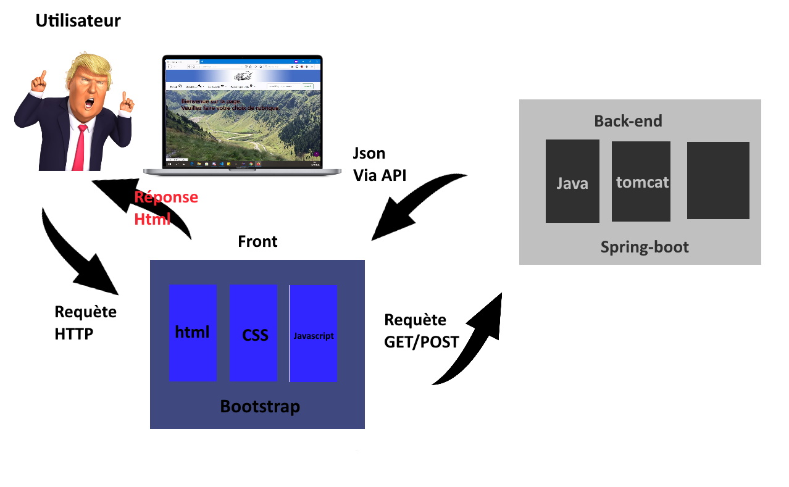

<body style="background-color:black;">

# services

<h1>Introduction:</h1>

<h2>Petite présentation du projet.</h2>

D'un commun accord avec le groupe nous avons fait le choix de faire notre projet autour de notre fil rouge. 
D'une pour nous avancer, mais aussi pour nous préparer pour la suite du projet 
Ma partie consistait à m'occuper de la partie services, qui sont hebergement, mécanique et carrosserie. 
Les gens s'inscrivent et proposent leur savoir faire ou un hébergement. 
La page à 3 onglets avec chacun 2 sous-onglets. On peut soit rechercher, ou aussi ajouter une fiche. 
Il est possible de rechercher par id en haut à droite.

<strong>Diagramme</strong>

<h2>EndPoints</h2>
<ul>
<li><code>/carrosserie/recherche</code>--Recherche dans la liste carrosserie</li>
<li><code>/mecanique/add</code>--Ajoute dans la liste mécanique</li>
<li><code>/rechercheId/{id}</code>--Recherche dans les 3 listes par Id</li>
</ul>

<strong>Exemple de requète</strong>

<pre><code>http://localhost:8080/services/hebergement/recherche</code></pre>

<strong>Résultat requète</strong>

<pre><code>[
{
id: 7,
user: "Jeannette",
localisation: "Montauroux",
comment: "Ouverte d'esprit, je partage mon lit avec qui veut bien",
nbCouchage: 1
},
{
id: 8,
user: "Gérard",
localisation: "Dijon",
comment: "Après l'amour est dans le pré, je me suis mis à la moto, j'ai une grande grange pour accueillir mes ami(e)s motard(e)s",
nbCouchage: 12
},
{
id: 9,
user: "Louis",
localisation: "Bordeaux",
comment: "Je fais de la moto depuis 40 ans et j'aime recevoir mes amis motards, et comme on dit: "Vieux motard que jamais". J'adore l'humour!",
nbCouchage: 3
},
{
id: 11,
user: "gerea",
localisation: "kekjr",
comment: "",
nbCouchage: 2
},
{
id: 14,
user: "gerea",
localisation: "kekjr",
comment: "",
nbCouchage: 3
}
]</code></pre>
<h2>Attributs</h2>
<ul>
<li><code>id</code>--Id de l'utilisateur</li>
<li><code>user</code>--Nom de l'utilisateur</li>
<li><code>localisation</code>--La localisation</li>
<li><code>comment</code>--Description de son offre</li>
<li><code>nbCouchage</code>--La possibilité de couchages</li>
</ul>

<strong>Saisie d'écran</strong>

</body>